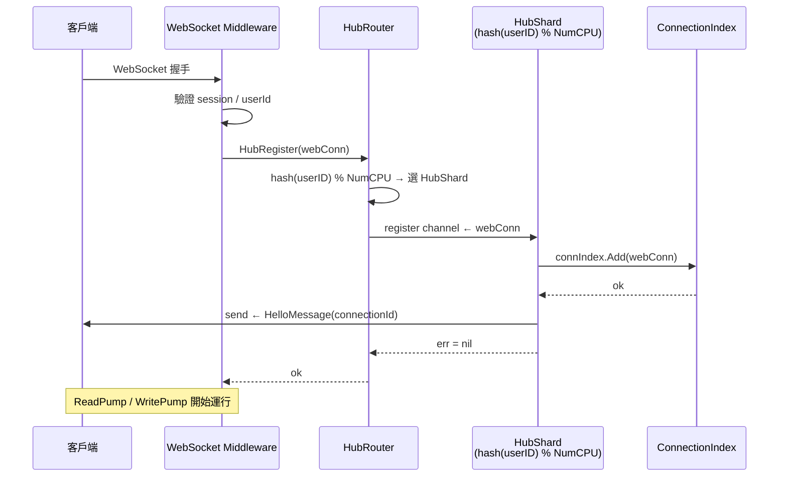
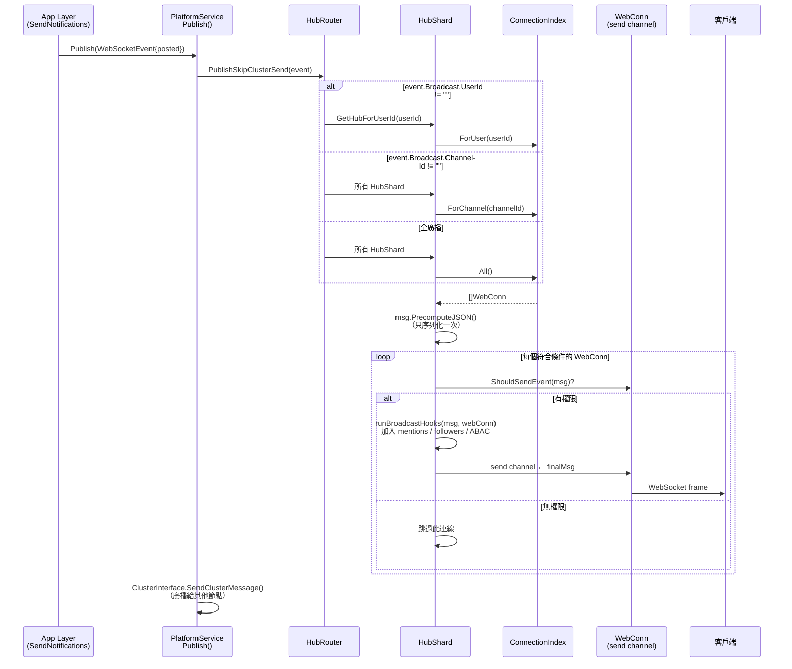
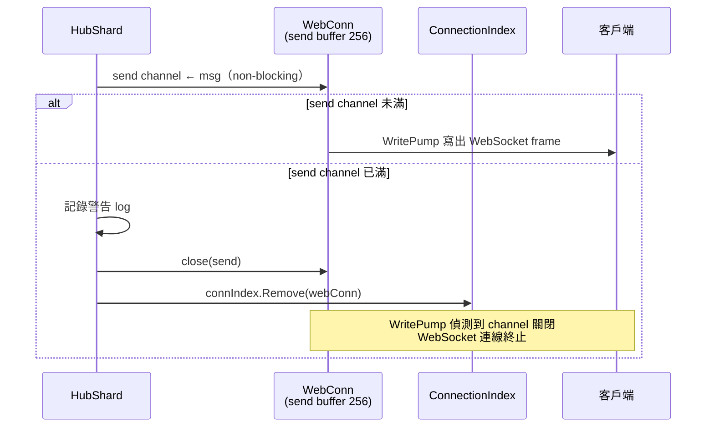
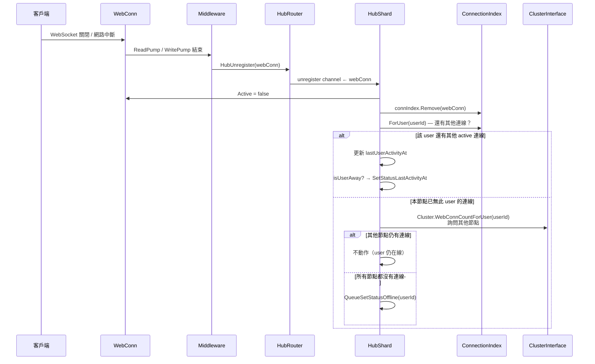
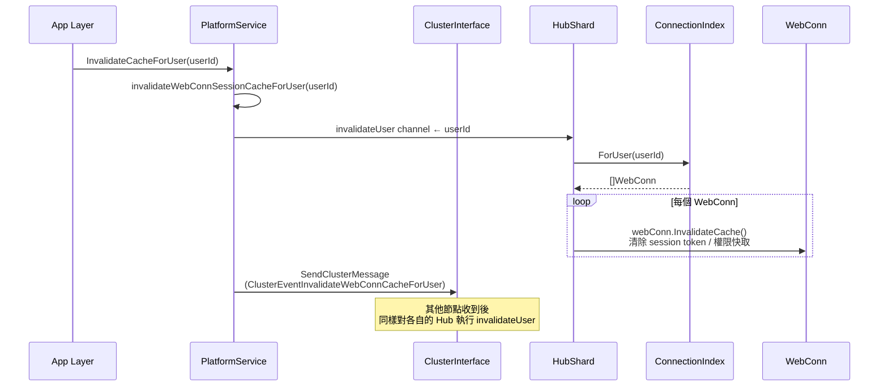
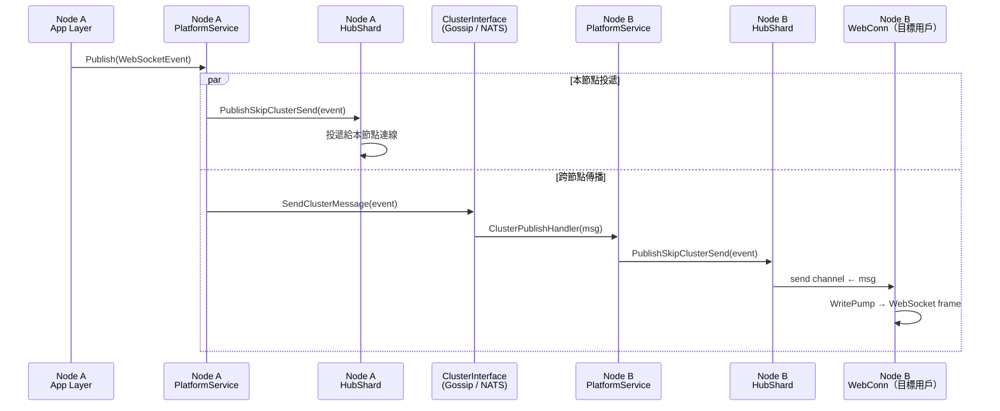
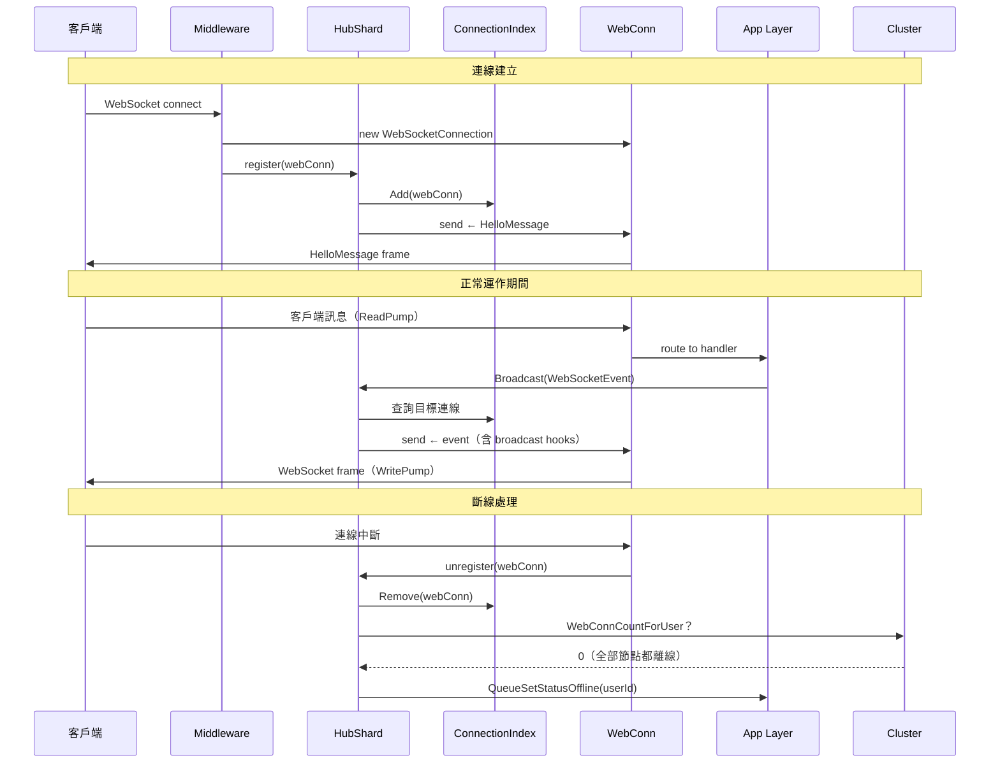

# Hub 循序圖

## 1. 客戶端連線建立（register）

---

## 2. 廣播事件（broadcast）— 以發送訊息為例

---

## 3. 廣播佇列滿（send channel full）

---

## 4. 客戶端斷線（unregister）

---

## 5. Session 失效（invalidateUser）

---

## 6. 跨節點廣播（叢集架構）

---

## 7. 完整生命週期總覽

